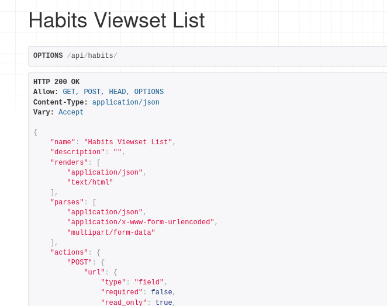

# Alprou (backend)

## Description
Backend server for [Alprou](https://github.com/0djentd/alprou).

## Installation
```
git clone https://github.com/0djentd/alprou_backend.git
cd alprou_backend
git pull --recurse-submodules
python -m venv .venv
source .venv/bin/activate
python -m pip install -r requirements.txt
```

Then create files named `django_key` and `db_config.py`.

```
./manage.py makemigrations
./manage.py migrate
./manage.py createsuperuser
./manage.py runserver
```
